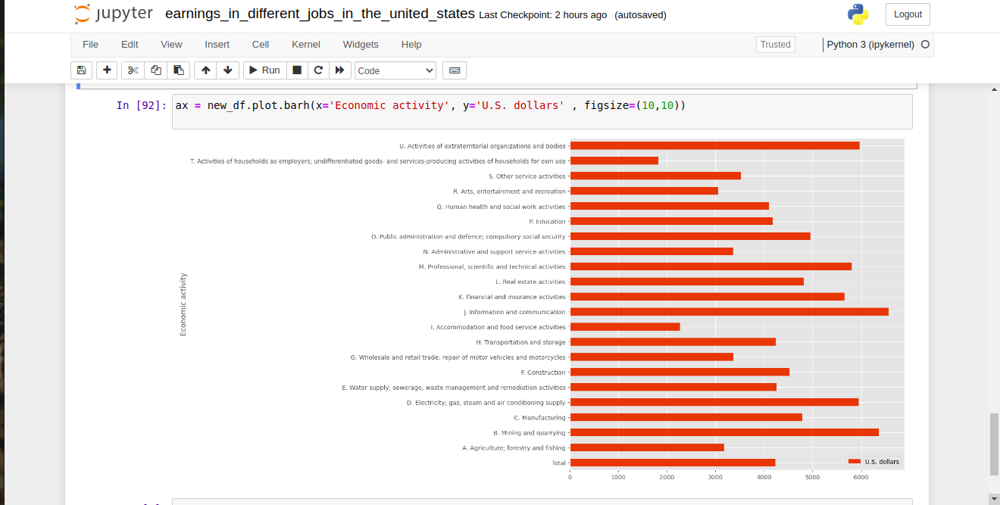

# Earnings in different Industries in the United States in 2019
The Data set used in this project was obtained from the International Labour Organisation website (https://ilostat.ilo.org)

# Key Take Aways

- People in the food industry are one the least paid workers in the American Labour force.

